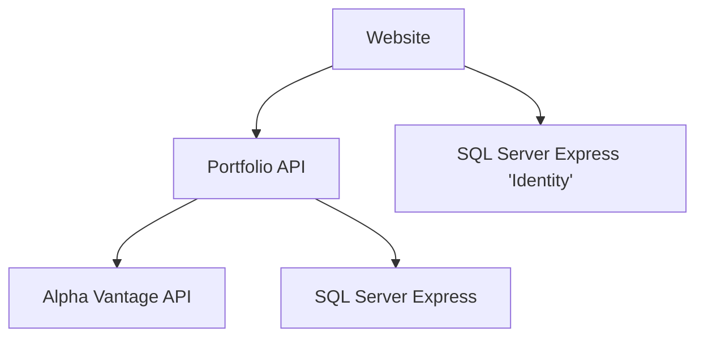

# BullAndBear

## Setup

### Alpha Vantage
This application uses the  Alpha Vantage API to retrieve stock related information.
While it is possible to use the key 'demo', possibly some functions may stop working.

Should any issues occur, a valid key can be inserted into the user secrets via:

 `dotnet user-secrets set "AlphaVantage:ServiceApiKey" "[INSERT KEY HERE]" --project PortfolioAPI`

 ### Database
 Runs off a MSSQL Local DB, which should usually be sufficient.
 Possibly might require running:
 `dotnet ef database update --project Website`

 ## Application Diagram

## Limitations

### Stock Data
The data available only covers this year, 2022.

### Stock Quantity
Assuming that no trade involves fractional shares. Although this is possible under certain conditions.
Checking for these conditions would be a good future enhancement.

### Trade Date Input
As for the trade the price is entered manually. 